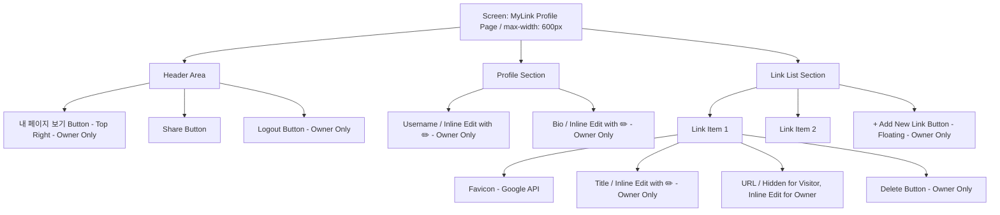

# 와이어프레임 (Wireframe) - 마이링크 (MyLink)

본 문서는 마이링크 서비스의 UI 구조를 시각적으로 정의한 와이어프레임입니다. 반응형 웹(Mobile-first) 구조를 기반으로 단일 페이지(Single Page) 안에서 **방문자 뷰(Visitor View)**와 **소유자 뷰(Owner View)**가 어떻게 다르게 렌더링되는지 설명합니다.

---

## 1. UI 구조도 (Mermaid Diagram)

전체적인 화면의 컴포넌트 계층 구조를 나타냅니다.



---

## 2. 방문자 뷰 (Visitor View) - ASCII Art

일반 방문자가 `mylink.com/displayName` 에 접속했을 때 보이는 화면입니다. 오직 클릭 가능한 링크의 제목(Title)만 깔끔하게 노출되며, 실제 URL 주소는 시각적으로 숨겨집니다. 편집 아이콘은 보이지 않습니다.

```text
+-------------------------------------------------+
|                                                 |
|                                         [공유]  |
|                                                 |
|               (No Profile Image)                |
|                    홍길동                       |
|           개발과 디자인을 사랑하는 사람         |
|                                                 |
|  +-------------------------------------------+  |
|  | [아이콘]  내 포트폴리오 웹사이트          |  |
|  +-------------------------------------------+  |
|                                                 |
|  +-------------------------------------------+  |
|  | [아이콘]  GitHub 리포지토리               |  |
|  +-------------------------------------------+  |
|                                                 |
|  +-------------------------------------------+  |
|  | [아이콘]  링크드인 프로필                 |  |
|  +-------------------------------------------+  |
|                                                 |
+-------------------------------------------------+
```

---

## 3. 소유자 뷰 (Owner View, 관리자 대시보드) - ASCII Art

소유자가 로그인한 뒤 접속했을 때 보이는 대시보드 화면입니다. 텍스트 옆에 **연필 아이콘(✏️)**이 표시되어 인라인 편집(Inline Edit)이 가능함을 직관적으로 보여줍니다. (수정 기능은 이 화면에서만 활성화됩니다). 또한 우측 상단에 '[내 페이지 보기]' 버튼이 고정되어 방문자 뷰를 쉽게 확인할 수 있습니다.

```text
+-------------------------------------------------+
|                        [내 페이지 보기] [로그아웃]
|                                                 |
|               (No Profile Image)                |
|                    홍길동 ✏️                    |
|           개발과 디자인을 사랑하는 사람 ✏️      |
|                                                 |
|  +-------------------------------------------+  |
|  | [아이콘]  내 포트폴리오 웹사이트 ✏️       [X]|  |
|  |           https://my-portfolio.com ✏️        |  |
|  +-------------------------------------------+  |
|                                                 |
|  +-------------------------------------------+  |
|  | [아이콘]  GitHub 리포지토리 ✏️            [X]|  |
|  |           https://github.com/myname ✏️       |  |
|  +-------------------------------------------+  |
|                                                 |
|                                                 |
|          (( + 새로운 링크 추가 버튼 ))          |
+-------------------------------------------------+
```

---

## 4. 컴포넌트별 상세 스펙 (shadcn/ui 기반)

* **배경 및 레이아웃:** 화면 중앙 정렬된 모바일 최적화 레이아웃 (최대 너비 약 600px 제한). 다크/라이트 모드 지원.
* **상단 헤더:** 소유자 뷰일 때 우측 상단에 `[내 페이지 보기]` 버튼이 고정(Sticky)으로 노출되어, 클릭 시 실제 방문자 뷰 페이지로 이동/새 탭 열기가 가능함.
* **편집 기능 시각화:** 닉네임, 소개글, 링크 제목 및 URL 텍스트 옆에 연필 아이콘(✏️)을 표시하여, 소유자(관리자) 화면에서만 클릭하여 즉시 텍스트를 수정할 수 있음을 명확히 안내함.
* **파비콘 아이콘:** 각 링크 좌측에 24x24px 크기로 둥글게(border-radius: 50%) 렌더링됨.
* **버튼:** 
  * '새로운 링크 추가' 버튼은 스크롤에 상관없이 화면 하단에 플로팅(Floating Action Button) 형태로 고정 배치하여 접근성을 높임.
  * '삭제(X)' 버튼은 호버 시에만 나타나거나 옅은 색으로 배치하여 실수로 클릭하지 않도록 함 (shadcn/ui의 Ghost button 활용).
